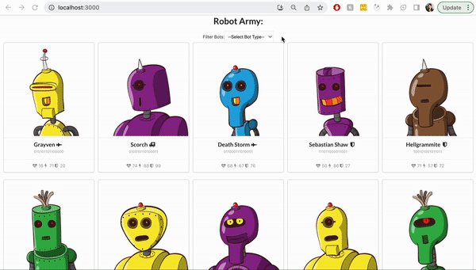
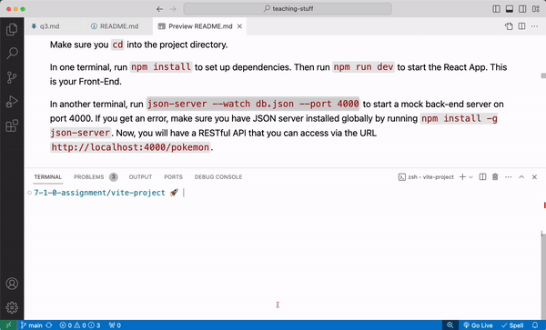

# 7-1-2 Assignment

**Table of Contents**:
- [Assignment Overview](#assignment-overview)
  - [Features:](#features)
  - [Set Up](#set-up)
  - [Before You Begin](#before-you-begin)
- [Starter Code](#starter-code)
  - [Adapters, BotList, BotsPage, and Filter.](#adapters-botlist-botspage-and-filter)
  - [Other Pages \& Files to Modify](#other-pages--files-to-modify)
  - [Semantic CSS](#semantic-css)
- [Technical Checklist](#technical-checklist)
- [Challenge](#challenge)

## Assignment Overview 
You are the commander of an intergalatic robot army. You need an app that will allow you to see and orgnize the members of your army. 



In this project, you will practice the following skills:

- reading through a React project codebase and understanding its structure
- using React Router to build a multi-page, front-end UI.
- using `useState`, `useEffect` and an adapter function to fetch and render data
- using `useParams` to utilize URL parameters
- using `Link` and `useNavigate` to provide navigation functionality


### Features:

**The first two of these features are already implemented.** The last three features are not. That's where you come in! 

1. [Completed] On load of the path `/`, you will make a `GET` fetch to an API and display all 50 robots on the page via the `BotsPage` component.
2. [Completed] You should be able to filter the robots on the `/` page by `bot_class`, either Assault, Defender, or Support.
3. [TODO] Navigating to `/robots/:id` should display a single robot via the `BotSpecsPage` component.
4. [TODO] If the user types in any URL other than `/` or `/robots/:id`, a "Page Not Found" page is rendered via the `NotFoundPage` component.
5. [TODO] Clicking on a bot should change the URL path to `/robots/:id`

You will need to utilize the following components and hooks from ReactRouter to complete these features:
- `BrowserRouter`
- `Routes`
- `Route`
- `Link`
- `useParams`
- `useNavigate`

### Set Up

For guidance on setting up and submitting this assignment, refer to the Marcy lab School Docs How-To guide for [Working with Short Response and Coding Assignments](https://marcylabschool.gitbook.io/marcy-lab-school-docs/fullstack-curriculum/how-tos/working-with-assignments#how-to-work-on-assignments).

After cloning your repository, make sure to create a `draft` branch:

```
git checkout -b draft
```

Then, `cd` into the `vite-project` directory and split your terminal into two:



In one terminal, run `npm install` to set up dependencies. Then run `npm start` to start the React App. This is your Front-End.

In the second terminal, run `npm run json-server`. This will turn the `db.json` file containing robot data into a working API with CRUD functionality.

**<details><summary>If you get an error</summary>**
> If you get an error, make sure you have JSON server installed globally by running `npm install -g json-server`. Now, you will have a RESTful API that you can access via the URL `http://localhost:4000/robots`.
</details><br>

**Wait, what is JSON server again?**

JSON Server is a tool to we use to spin up a mock API. It is a great alternative when you don't have the time to build out a full API. It does have its limitation in that it cannot support a robust relationships database. Learn more by reading the [JSON Server documentation](https://github.com/typicode/json-server#getting-started).

Once your server is up and running, you should see the grid of robots with a working filter!

### Before You Begin

Before jumping into coding, take some time to understand the provided code. This will make it easier to navigate around the files!

The technical checklist is below and will be used to determine your overall score on the assignment.

## Starter Code

Like we said earlier, the first two features of the application are built for you. Take some time to understand the code that powers the app.

We've given you:
- `main.jsx` and `App.jsx` — the entry points of the application
- `/pages` — the main pages of the application
- `/components` — components used within the pages of the application
- `/adapters` - the helper functions used to fetch robot data from the `json-server` API

There are _a lot_ of hints that the starter code gives you. Although you are allowed to change up the starter code however you'd like, it will be easiest to let the existing code guide you into building out this app.

### Adapters, BotList, BotsPage, and Filter.

As you can see, the robots are currently being fetched from the `json-server` API and rendered on the page. Let's work our way backwards from the API to understand how this works.

In the `adapters/robotAdapters` we've created some simple adapters for fetching from the JSON server. There are two:
1. `getAllRobots()` — fetches all robots to be displayed by the `BotsList` component
2. `getRobotById(id)` — fetches a single robot to be displayed by the `BotSpecs` component.

The `BotsList` component is already set up to use the `getAllRobots` adapter to fetch and then render all robots. It's parent component, `BotsPage`, helps coordinate the filter functionality with the `Filter` component.

Right now, in `App`, this `BotsPage` component is the only page component being rendered.

### Other Pages & Files to Modify

There are two other pages that are provided for you.
1. `BotSpecsPage` — meant to display details about a single robot.
2. `NotFoundPage` — meant to display a message letting the user know they have navigated to an unknown page.

Your main task will be to set up React Router such that the user can navigate between all three pages of the application. The following files must be modified to achieve this:
* `main.jsx`
* `App.jsx`

Once navigation is enabled, you'll need to make modifications to the following files:
* `components/BotCard.jsx` — update this file to navigate users to `robots/${id}` according to the robot that was clicked on.
* `components/BotSpecs.jsx` — update this file to fetch and render a robot according to the robot `id` in the URL
* `components/GoHomeButton.jsx` — update this file to redirect the user to `/` when the button is clicked.

### Semantic CSS

Curious about the styles?

Take a look at the `index.html` file and you'll see a link to include Semantic UI stylesheet:

```html
<link rel="stylesheet" href="//cdnjs.cloudflare.com/ajax/libs/semantic-ui/2.2.12/semantic.min.css"></link>
```

_[Learn more about Semantic UI here](https://semantic-ui.com/)_

## Technical Checklist

There are 18 tasks to complete and 1 bonus.

Your goal is to meet at least 75% of these requirements to complete the assignment. But don't stop there! Shoot for 100%!

**Functionality**
- [ ] Navigating to `/` renders the `BotsPage`
- [ ] Clicking on a robot navigates the user to `/robots:/id` where `:id` is the id of the clicked robot.
- [ ] Navigating to `/robots/:id` renders the `BotSpecsPage`
- [ ] The `BotSpecsPage` renders the robot whose `id` matches the `:id` portion of the URL
- [ ] Navigating to any other URL renders the `NotFoundPage` component
- [ ] Wherever the `GoHomeButton` component is rendered, clicking on the button navigates the user back to the `/` page.

**React Fundamentals**
- [ ] Uses `BrowserRouter` in `main.jsx` to provide routing to the entire `App`
- [ ] Uses `Routes` in `App.jsx` to render multiple Routes
- [ ] Uses `Route` to render a component based on the URL
- [ ] Uses `Link` in `GoHomeButton.jsx` to render a component that redirects the user upon click
- [ ] Uses `useParams` in `BotSpec.jsx`to get the `id` value from the URL
- [ ] Uses `useState` in `BotSpec.jsx` to set up `robot` and `error` state for fetching
- [ ] Uses `useEffect` in `BotSpec.jsx` to fetch the robot according to the `id`
- [ ] Injects `robot` data into the `BotSpec` component using proper JSX syntax
- [ ] Renders fallback components in the event that the fetch fails or a robot is not found.
- [ ] Uses `useNavigate` in `BotCard.jsx` to programmatically redirect the user to the home page.

**Miscellaneous**
- [ ] Props are extracted in child components using destructuring
- [ ] At no point did you ever use any vanilla DOM JS methods (e.g. `document.querySelector` or `document.createElement`)
- [ ] Bonus: Your project has some extra CSS styling!

When you are finished, push your code up to Github and submit on Canvas.

## Challenge

Looking for more?? This app that you've built is very similar to the personal pokedex app from the last assignment! Take a stab at incorporating React Router into that app. 

Build a `PokemonSpec` page and whenever you click on a pokemon, navigate the user to a `/pokemon/:id` URL and render the appropriate pokemon in your `PokemonSpec` page.
